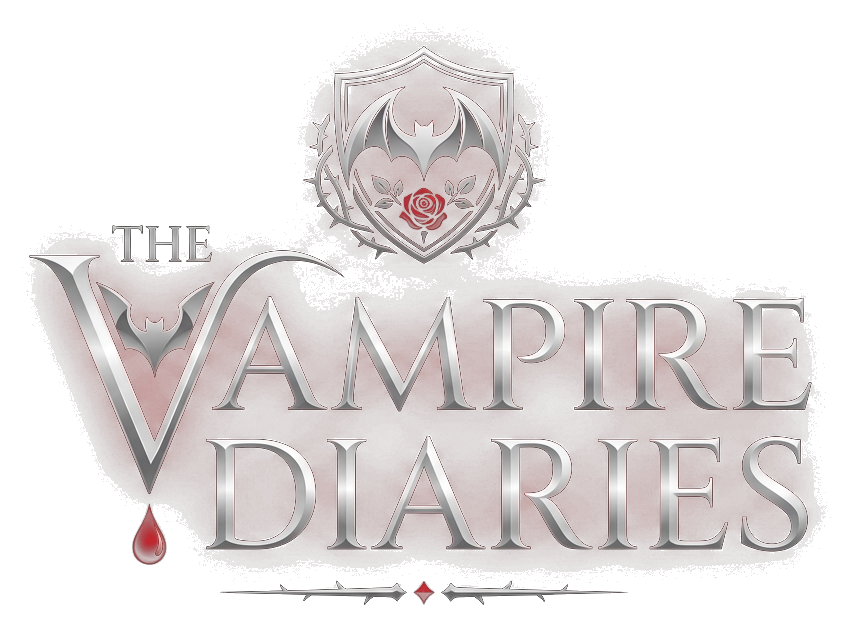
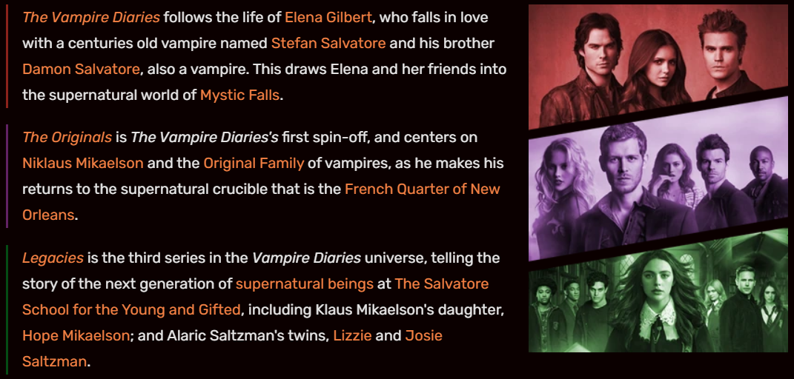

<div align="center">

  

  # 🩸 MYSTIC FALLS 🩸
  ### *The Vampire Diaries — Supernatural Trivia & Lore Sanctum*

  <p align="center">
    <strong>"Hello, Brother."</strong><br>
    <em>Step across the town threshold into a world drenched in blood, immortal love, ancient covens, and eternal betrayals.</em>
  </p>

  <p align="center">
    <a href="https://tvd-quiz-app.vercel.app/"></a>
    <a href="#-the-sanctuary-features"></a>
    <a href="#-installation--local-ritual"></a>
  </p>

  <p align="center">
    
    
    
    
    
  </p>

</div>

---

> 🩸 *"For over a century, I have lived in secret; hiding in the shadows, alone in the world. Until now. I am a vampire. And this is my story."*  
> — **Stefan Salvatore**

---

## ⚜️ Table of Contents

- [🌌 The Mystic Falls Experience](#-the-mystic-falls-experience)
- [⚔️ The Sanctuary Features](#️-the-sanctuary-features)
- [👥 The Immortals Gallery](#-the-immortals-gallery)
- [🕯️ Grimoire & Relics](#️-grimoire--relics)
- [⌛ Chronology of Blood](#-chronology-of-blood)
- [🏰 Technical Architecture](#-technical-architecture)
- [🔮 Installation & Local Ritual](#-installation--local-ritual)
- [☁️ Cloud & Serverless Deployment](#️-cloud--serverless-deployment)
- [👑 Council Vault & Permissions](#-council-vault--permissions)
- [📜 Lore & Acknowledgements](#-lore--acknowledgements)

---

## 🌌 The Mystic Falls Experience

**The Vampire Diaries Quiz App** is an immersive, gothic web application crafted for fans of *The Vampire Diaries*, *The Originals*, and *Legacies*. Blending deep supernatural lore with an interactive quiz engine, dark glassmorphism, fluid micro-animations, and full mobile-first responsiveness, this sanctuary tests whether you have what it takes to survive among the predators of Mystic Falls.

<div align="center">
  
</div>

---

## ⚔️ The Sanctuary Features

### 1. 🩸 The Sanctuary of Trials (3-Tier Quiz Engine)
- **3 Difficulty Tiers**:
  - 🌕 **Tier I — Novice**: Mortal history, town founders, and early encounters.
  - 🌙 **Tier II — Hunter**: The Gilbert Ring, Bennett witch spells, moonlight rings, and hybrid curses.
  - 💀 **Tier III — Original Master**: 1,000-year Mikaelson bloodlines, Silas, the Other Side, and Prison Worlds.
- **Dynamic Questions**: 10 randomized queries per session with live timer countdown, audio cues, and immediate accuracy analysis.

### 2. 📜 The Mystic Falls Grimoire & Ancient Relics
- An interactive catalog of enchanted artifacts that shaped supernatural warfare:
  - 💍 **Daylight Rings** (Lapis Lazuli sun protection crafted by Bennett witches).
  - 🛡️ **The Gilbert Ring** (Resurrection from supernatural deaths).
  - 🗡️ **The White Oak Stake** (The singular weapon lethal to an Original Vampire).
  - 🌌 **The Ascendant** (Celestial key to Gemini Coven Prison Worlds).

### 3. ⏳ Chronology of Blood
- An interactive milestone timeline tracing a millennium of history:
  - **1000 AD**: Esther Mikaelson invokes the dark solar spell forging the first vampires.
  - **1864 AD**: The Battle of Mystic Falls; Stefan & Damon are turned by Katherine Pierce.
  - **2009 AD**: The Return to Mystic Falls and the tomb vampire awakening.
  - **2018 AD**: Founding of the Salvatore Boarding School for the Young & Gifted.

### 4. 🎭 The Salvatore Dichotomy
- **Faction Duel**: Choose your allegiance between **Stefan Salvatore** (*Noble Redemption*) and **Damon Salvatore** (*Beautiful Danger*).
- Interactive screen flash pulses (red blood pulse / crimson shockwave) with choices remembered across sessions via `localStorage`.

### 5. 🎵 Gothic Vinyl Record Ambient Player
- A persistent spinning vinyl record player in the lower corner of the realm, spinning to the atmospheric melody of Lana Del Rey's *"Salvatore"*, with toggle needle arm and pulse effects.

### 6. 🏆 Hunter Dossier & The Eternal Scoreboard
- Real-time leaderboard powered by TiDB Cloud Serverless MySQL window ranking functions (`DENSE_RANK()`).
- Player Hub detailing hunter rank, accuracy percentage, and trial achievements.

### 7. 👑 The Council Vault (High Overseer Admin Portal)
- Dedicated overseer portal for Grimoire Management:
  - **Question Vault**: Live keyword search and filtering across difficulty tiers.
  - **Add Question**: Modal question creation with input validation.
  - **Registered Hunters Directory**: User table with instant client-side filtering by name, email, or mobile.

### 8. 📱 Ultra-Responsive Across All Realms
- **Desktop**: 3-column side-by-side About section with animated scrolling cards on the left, the dark red-bordered Legacy card in the middle, and the atmospheric video player on the right.
- **Tablets & Mobile**: Off-canvas sliding drawers, touch-friendly horizontal carousels, and responsive single-column card flows.

---

## 👥 The Immortals Gallery

<table align="center">
  <tr>
    <td align="center" width="25%">
      <br>
      <strong>Stefan Salvatore</strong><br>
      <em>The Ripper / The Hero</em>
    </td>
    <td align="center" width="25%">
      <br>
      <strong>Damon Salvatore</strong><br>
      <em>The Eternal Rebel</em>
    </td>
    <td align="center" width="25%">
      <br>
      <strong>Elena Gilbert</strong><br>
      <em>The Petrova Doppelgänger</em>
    </td>
    <td align="center" width="25%">
      <br>
      <strong>Katherine Pierce</strong><br>
      <em>The Survivor / Queen of Hell</em>
    </td>
  </tr>
</table>

Explore full bios, bloodline origins, and iconic quotes for **Klaus Mikaelson**, **Elijah Mikaelson**, **Caroline Forbes**, **Bonnie Bennett**, and **Lorenzo St. John** inside the interactive [Characters Archive](https://tvd-quiz-app.vercel.app/characters).

---

## 🏰 Technical Architecture

```text
├── api/
│   └── index.py            # Vercel Serverless WSGI Handler
├── static/
│   ├── css/
│   │   └── style.css       # Unified Gothic / Glassmorphism Design System
│   ├── img/                # High-definition TVD character portraits & lore assets
│   ├── js/                 # Client scripts & interactive widgets
│   ├── video/              # Ambient background & legacy cinematic video
│   └── Salvatore.mp3       # Gothic vinyl ambient track
├── templates/
│   ├── mainLayout.html     # Base public layout (Navbar, footer, music widget)
│   ├── userLayout.html     # Hunter sanctum layout (Flush glassmorphic sidebar)
│   ├── adminLayout.html    # Council vault layout (Overseer administration)
│   ├── index.html          # Cinematic hero, quote slider & lore archives
│   ├── about.html          # 3-column legacy showcase, grimoire, timeline & battle
│   ├── characters.html     # Interactive supernatural archives
│   ├── quiz.html           # Trial entry portal
│   ├── userPlayQuiz.html   # Active quiz HUD & timer engine
│   ├── userScoreBoard.html # Real-time ranking board
│   ├── userRecord.html     # Registered hunters directory with live search
│   └── quizView.html       # Question bank management
├── admin.py                # Admin database transactions
├── user.py                 # Hunter authentication & quiz operations
├── db.py                   # TLS/SSL-enabled MySQL connection pool (TiDB Cloud)
├── myEmail.py              # OTP transmission via SMTP
├── encryption.py           # Cryptographic password hashing (SHA-256)
├── schema.sql              # Relational database DDL schema
└── vercel.json             # Serverless deployment routing & static caching
```

---

## 🔮 Installation & Local Ritual

### 1. Summon the Codebase
```bash
git clone https://github.com/nikkita18/tvd-quiz-app.git
cd tvd-quiz-app
```

### 2. Prepare the Python Vessel
```bash
# Create virtual environment
python -m venv .venv

# Activate on Windows (PowerShell):
.venv\Scripts\Activate.ps1

# Activate on macOS/Linux:
source .venv/bin/activate

# Install dependencies
pip install -r requirements.txt
```

### 3. Enscribe Environment Secrets
Create a `.env` file in the root directory:

```env
# Database Credentials (TiDB Cloud Serverless or Local MySQL)
DB_HOST=gateway01.ap-southeast-1.prod.aws.tidbcloud.com
DB_PORT=4000
DB_USER=your_tidb_user.root
DB_PASSWORD=your_secure_password
DB_NAME=b12_app
DB_SSL=true

# Application Security
SECRET_KEY=your_mystic_falls_secret_key

# SMTP Dispatch (For OTP Verification)
MAIL_USERNAME=your_email@gmail.com
MAIL_PASSWORD=your_app_password
```

### 4. Initialize Database
```bash
# Run schema migration
mysql -h <DB_HOST> -P <DB_PORT> -u <DB_USER> -p <DB_NAME> < schema.sql

# Seed lore questions
python seed_questions.py
```

### 5. Awaken the Sanctuary
```bash
python app.py
```
Open your browser at `http://localhost:5001`.

---

## ☁️ Cloud & Serverless Deployment

This application is built from the ground up for seamless serverless execution on **Vercel** with **TiDB Cloud Serverless MySQL**:

1. **Database**: Hosted on TiDB Cloud Serverless with TLS encryption enabled.
2. **Serverless Entrypoint**: `api/index.py` wraps the Flask WSGI application for edge handling.
3. **Routing**: `vercel.json` maps dynamic requests to `@vercel/python` while serving static assets via Vercel's global edge network.

To deploy your own fork:
```bash
npm install -g vercel
vercel
```

---

## 👑 Council Vault & Permissions

| Role | Access URL | Capabilities |
| :--- | :--- | :--- |
| **Hunter (User)** | `/userLogin` | Take trials across 3 tiers, view profile dossier, track score history, view live leaderboard. |
| **High Overseer (Admin)** | `/adminLogin` | Browse the question bank, live-filter hunters by contact, insert new trivia questions, manage quiz levels. |

---

## 📜 Lore & Acknowledgements

> 🩸 *"I’ve been in love. It’s painful, pointless, and overrated. But I can’t resist it."*  
> — **Damon Salvatore**

- Inspired by the iconic universe created by **L.J. Smith**, **Julie Plec**, and **Kevin Williamson**.
- Soundtrack: *"Salvatore"* by **Lana Del Rey**.
- Developed with dark passion & blood-red aesthetics by **[Nikita Kumari](https://github.com/nikkita18)**.

<div align="center">
  <br>
  <sub>“Welcome to the story that never ends.” &bull; ⚜️ Mystic Falls, Virginia ⚜️</sub>
</div>
